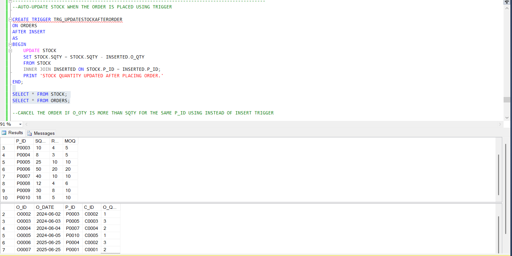

# 📦 Smart Inventory Management System Using SQL

This is a complete Inventory Management System built using Microsoft SQL Server. It manages products, customers, orders, suppliers, and stock with automation.

---

## ✅ What This Project Includes

- Tables with Primary Key, Foreign Key, NOT NULL, UNIQUE, CHECK constraints
- Stored Procedures to add customer, supplier, product, and place order
- Triggers to:
  - Update stock when order is placed
  - Cancel order if stock is not enough
- User-defined functions for:
  - Auto ID generation
  - Calculations
- Views to show:
  - Department-wise employee stats
  - Manager reports
  - Salary analysis

---

## 📂 Project Files 

### 1. Table Creation with Constraints

### 2. Sample Data in Tables

### 3. Trigger: Auto Stock Update After Order

### 4. Trigger: Block Order If Not Enough Stock

### 5. Stored Procedure Execution (e.g., ADDPRO, ADDORDER)

### 6. Auto ID Generation Using Function

### 7. Business Query: Low Stock Alert

---

## 🛠 Tools Used

- Microsoft SQL Server
- SSMS (SQL Server Management Studio)
- GitHub (for version control and portfolio)

---

## 🔗 How to Use This Project

1. Download or clone this repository
2. Run `Inventory_Tables.sql` to create tables
3. Add data
4. Run `Procedures.sql`, `Triggers.sql`, and `Views.sql`
5. Use `Sample_Queries.sql` to check output

---

## 🙋‍♂️ About Me

👤 **Aniket Roy**  
🎯 Business Analyst (Excel + SQL + MongoDB + Tableau + Power BI)  
📬 aroy72325@gmail.com
🔗 www.linkedin.com/in/aniket-roy-00251b214
